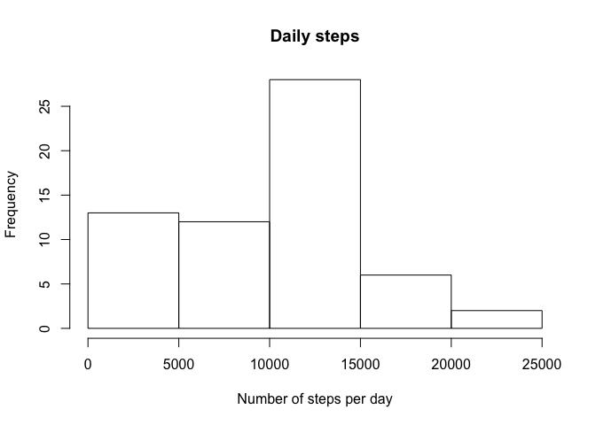
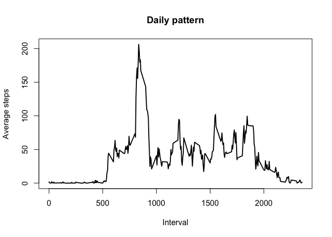
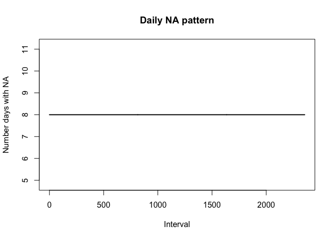
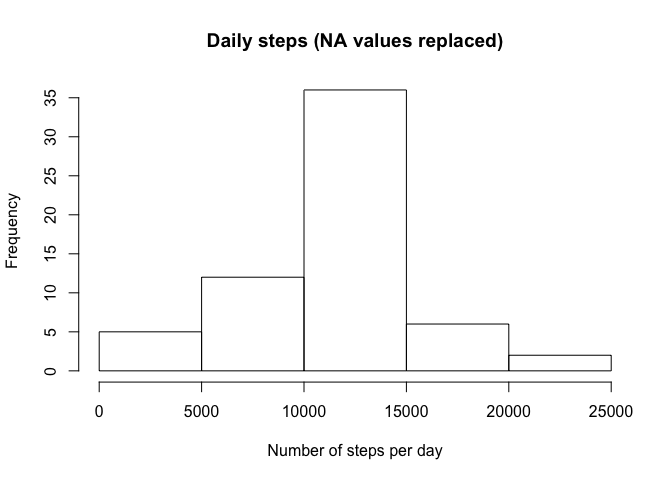
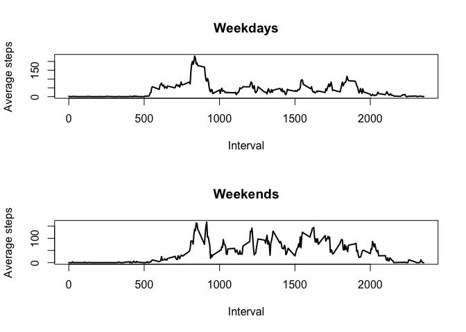

# Steps activity analysis

This study analysed personal movement collected using activity monitoring devices such as a Fitbit, Nike Fuelband, or Jawbone Up. These type of devices are part of the “quantified self” movement – a group of enthusiasts who take measurements about themselves regularly to improve their health, to find patterns in their behavior, or because they are tech geeks. 

Personal activity data was collected at 5 minute intervals through out the day using one activity monitoring device. The data consists of two months of data from an anonymous individual collected during the months of October and November, 2012.

The variables included in this dataset are:

- steps: Number of steps taking in a 5-minute interval (missing values are coded as NA)
- date: The date on which the measurement was taken in YYYY-MM-DD format
- interval: Identifier for the 5-minute interval in which measurement was taken

## Data download and unzip 
If file not present, download from url

```r
url <- "https://d396qusza40orc.cloudfront.net/repdata%2Fdata%2Factivity.zip"
fileName <- "activity.zip"
if(!file.exists(fileName)){
  cat("Downloading data zip file...\n")
  download.file(url,fileName, mode = "wb") # "wb" mode - binary files 
}
```

## Data download and unzip 
If directory does not exist, unzip the downloaded file.

```r
file <- "activity.csv"
if(!file.exists(file)){
  cat("Unzipping data file...\n")
  unzip(fileName, files = NULL, exdir=".")
}
```

## Read the data


```r
df <- read.csv(file, header=TRUE, stringsAsFactors = FALSE, na.strings = "NA")
```

## Inspect the data

```r
str(df)
```

```
## 'data.frame':	17568 obs. of  3 variables:
##  $ steps   : int  NA NA NA NA NA NA NA NA NA NA ...
##  $ date    : chr  "2012-10-01" "2012-10-01" "2012-10-01" "2012-10-01" ...
##  $ interval: int  0 5 10 15 20 25 30 35 40 45 ...
```

```r
head(df)
```

```
##   steps       date interval
## 1    NA 2012-10-01        0
## 2    NA 2012-10-01        5
## 3    NA 2012-10-01       10
## 4    NA 2012-10-01       15
## 5    NA 2012-10-01       20
## 6    NA 2012-10-01       25
```

```r
summary(df)
```

```
##      steps            date              interval     
##  Min.   :  0.00   Length:17568       Min.   :   0.0  
##  1st Qu.:  0.00   Class :character   1st Qu.: 588.8  
##  Median :  0.00   Mode  :character   Median :1177.5  
##  Mean   : 37.38                      Mean   :1177.5  
##  3rd Qu.: 12.00                      3rd Qu.:1766.2  
##  Max.   :806.00                      Max.   :2355.0  
##  NA's   :2304
```

## Process the data
Convert date formats

```r
df$date <- ymd(df$date)
str(df)
```

```
## 'data.frame':	17568 obs. of  3 variables:
##  $ steps   : int  NA NA NA NA NA NA NA NA NA NA ...
##  $ date    : Date, format: "2012-10-01" "2012-10-01" ...
##  $ interval: int  0 5 10 15 20 25 30 35 40 45 ...
```

```r
summary(df)
```

```
##      steps             date               interval     
##  Min.   :  0.00   Min.   :2012-10-01   Min.   :   0.0  
##  1st Qu.:  0.00   1st Qu.:2012-10-16   1st Qu.: 588.8  
##  Median :  0.00   Median :2012-10-31   Median :1177.5  
##  Mean   : 37.38   Mean   :2012-10-31   Mean   :1177.5  
##  3rd Qu.: 12.00   3rd Qu.:2012-11-15   3rd Qu.:1766.2  
##  Max.   :806.00   Max.   :2012-11-30   Max.   :2355.0  
##  NA's   :2304
```

## Mean total number of steps per day

### 1. Calculate the total number of steps taken per day
The total number of steps taken per day was calculated by summing the observations in each day (excluding NA values).

```r
metrics <- df %>%
  group_by(date) %>%
  summarize(no.obs = n(), daily.steps = sum(steps, na.rm = TRUE)) %>%      
  print
```

```
## # A tibble: 61 x 3
##    date       no.obs daily.steps
##    <date>      <int>       <int>
##  1 2012-10-01    288           0
##  2 2012-10-02    288         126
##  3 2012-10-03    288       11352
##  4 2012-10-04    288       12116
##  5 2012-10-05    288       13294
##  6 2012-10-06    288       15420
##  7 2012-10-07    288       11015
##  8 2012-10-08    288           0
##  9 2012-10-09    288       12811
## 10 2012-10-10    288        9900
## # ... with 51 more rows
```

### 2. Distribution of total steps per day
Figure 1. Histogram distribution of the total steps per day.

```r
hist(metrics$daily.steps, xlab="Number of steps per day", main="Daily steps")
```

<!-- -->

### 3. Mean and median of the total number of steps per day

The number of steps each day had a mean of 

```r
mean(metrics$daily.steps, na.rm=TRUE)
```

```
## [1] 9354.23
```

and a median of 

```r
median(metrics$daily.steps, na.rm=TRUE)
```

```
## [1] 10395
```

## Average daily activity pattern

### 1. Time series

Figure 2. Time series plot (i.e. type="l") of all observations (5-minute intervals), with the average number of steps averaged across all days overlaid on the plot.

```r
dailypattern <- df %>%
  group_by(interval) %>%
  summarize(no.days = n(), interval.steps = mean(steps, na.rm = TRUE)) 
str(dailypattern)
```

```
## Classes 'tbl_df', 'tbl' and 'data.frame':	288 obs. of  3 variables:
##  $ interval      : int  0 5 10 15 20 25 30 35 40 45 ...
##  $ no.days       : int  61 61 61 61 61 61 61 61 61 61 ...
##  $ interval.steps: num  1.717 0.3396 0.1321 0.1509 0.0755 ...
```

```r
plot(dailypattern$interval, dailypattern$interval.steps, 
     type="l", xlab="Interval", ylab="Average steps", 
     main="Daily pattern", lwd=2)
```

<!-- -->

### 2. Peak time interval

The daily pattern peaks with a maximum average number of steps of 

```r
max(dailypattern$interval.steps, na.rm=TRUE) 
```

```
## [1] 206.1698
```
This peak occurs in the 5-minute interval of

```r
dailypattern$interval[which(dailypattern$interval.steps==
                              max(dailypattern$interval.steps, na.rm=TRUE))]
```

```
## [1] 835
```
minutes into the day.


## Imputing missing values

Note that there are a number of days/intervals where there are missing values (coded as NA). The presence of missing days may introduce bias into some calculations or summaries of the data.

### 1. Missing values

The total number of missing values in the dataset (i.e. the total number of rows with NAs) is:

```r
sum(is.na(df$steps))
```

```
## [1] 2304
```

### 2. Imputing missing values

Missing values are imputed using the mean number of steps in that 5 minute interval averaged over all days.

```r
napattern <- df %>%
  filter(is.na(steps)) %>%
  group_by(interval) %>%
  summarize(no.NA.days = n()) 
plot(napattern$interval, napattern$no.NA.days, 
     type="l", xlab="Interval", ylab="Number days with NA", 
     main="Daily NA pattern", lwd=2)
```

<!-- -->


### 3. Data corrected for missing values 
Create a new dataset that is equal to the original dataset but with the missing data filled in.

```r
naind <- which(is.na(df$steps))
head(df[naind,])
```

```
##   steps       date interval
## 1    NA 2012-10-01        0
## 2    NA 2012-10-01        5
## 3    NA 2012-10-01       10
## 4    NA 2012-10-01       15
## 5    NA 2012-10-01       20
## 6    NA 2012-10-01       25
```

```r
dfc <- df
for (i in naind) {
  di <- which(dailypattern$interval == df$interval[i])
  dfc$steps[i] <- dailypattern$interval.steps[di]
}
```


### 4. Histogram

Make a histogram of the total number of steps taken each day and Calculate and report the mean and median total number of steps taken per day. Do these values differ from the estimates from the first part of the assignment? What is the impact of imputing missing data on the estimates of the total daily number of steps?

Figure 3. Histogram distribution of the total steps per day of corrected dataset.

```r
metricsc <- dfc %>%
  group_by(date) %>%
  summarize(no.obs = n(), daily.steps = sum(steps, na.rm = TRUE)) 
hist(metricsc$daily.steps, xlab="Number of steps per day", main="Daily steps (NA values replaced)")
```

<!-- -->

Mean and median of the total number of steps per day of corrected dataset

The number of steps each day had a mean of 

```r
mean(metricsc$daily.steps, na.rm=TRUE)
```

```
## [1] 10766.19
```

and a median of 

```r
median(metricsc$daily.steps, na.rm=TRUE)
```

```
## [1] 10766.19
```
This shows that the replacement of NA values with imputed values has increased the summed number of steps over each day, as expected.


## Differences in activity patterns between weekdays and weekends

For this part the weekdays() function may be of some help here. Use the dataset with the filled-in missing values for this part.

Next, a new factor variable was added to the dataset with two levels – “weekday” and “weekend” to indicate whether a given date is a weekday or weekend day.

```r
dfc <- tbl_df(dfc)
weekdays1 <- c('Monday', 'Tuesday', 'Wednesday', 'Thursday', 'Friday')
dfc$wDay <- factor((weekdays(dfc$date) %in% weekdays1), 
         levels=c(FALSE, TRUE), labels=c('weekend', 'weekday')) 
head(dfc)
```

```
## # A tibble: 6 x 4
##    steps date       interval wDay   
##    <dbl> <date>        <int> <fct>  
## 1 1.72   2012-10-01        0 weekday
## 2 0.340  2012-10-01        5 weekday
## 3 0.132  2012-10-01       10 weekday
## 4 0.151  2012-10-01       15 weekday
## 5 0.0755 2012-10-01       20 weekday
## 6 2.09   2012-10-01       25 weekday
```

Next, a panel plot containing a time series plot (i.e. type="l") was made of the 5-minute interval (x-axis) and the average number of steps taken, averaged across all weekday days or weekend days (y-axis). 

Figure 4. Daily activity pattern averaged across all weekdays and weekend days.

```r
dailypattern_wd <- dfc %>%
  filter(wDay == "weekday") %>%
  group_by(interval) %>%
  summarize(no.days = n(), interval.steps = mean(steps, na.rm = TRUE)) 
dailypattern_we <- dfc %>%
  filter(wDay == "weekend") %>%
  group_by(interval) %>%
  summarize(no.days = n(), interval.steps = mean(steps, na.rm = TRUE)) 

par(mfrow=c(2,1))
plot(dailypattern_wd$interval, dailypattern_wd$interval.steps, 
     type="l", xlab="Interval", ylab="Average steps", 
     lwd=2, main="Weekdays")
plot(dailypattern_we$interval, dailypattern_we$interval.steps, 
     type="l", xlab="Interval", ylab="Average steps", 
     lwd=2, main="Weekends")
```

<!-- -->

